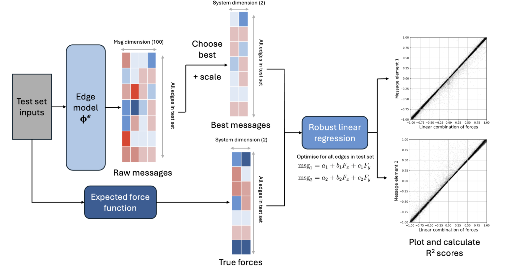
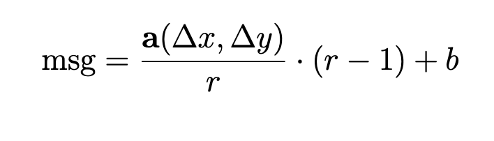

# Symbolic Distillation of Graph Neural Networks

## Description
The aim of this project is to reproduce the main results of the paper [Discovering Symbolic Models from Deep Learning with Inductive Biases](https://arxiv.org/abs/2006.11287) by Cranmer et al., as part of the MPhil in Data Intensive Science at the University of Cambridge. \
In this project, we train a different variations of a graph neural network (GNN) (standard, bottleneck, L1, KL and pruning) on particle datasets with different interaction forces (charge, $r^{-1}$, $r^{-2}$ and spring). In all cases, we train on 2D data with four interacting particles.\
We firstly validate whether the GNNs learn the true forces by performing a linear regression of the true forces on the most important messages. Seperately we then perform a symbolic regression to the message elements using *PySR* to test whether we are capable of reconstructing the true force laws. By combining deep learning with symbolic regression, this framework could be extended to search for new empirical laws in high-dimensional data.\
We have extended on the original project by introducing a new model variation, the pruning model, where the dimensionality of the messages decreases throughout training.\
We have also created a new demo Colab notebook, `demo.ipynb`, where the user can test the pipeline on any of the interaction forces or model variations, as an attempt to increase the reproducibility of the pipeline. 

## Navigating the repo
```
eszt2
├── LICENSE
|
├── README.md
|
├── demo.ipynb #demo colab
|
├── linrepr_plots/ #linear combination plots and R2 scores stored here
|
├── media_for_readme/ #folder for the images in this README
|
├── model.py #GNN PyTorch Geometric models
|
├── plot_linear_rep.py #plot the linear combination of forces and calculate R2
|
├── pruning_experiments.py #run the pruning hyperparamter experiments
|
├── report_plots/ #plots for the report
|
├── report/ #report and executive summary in here
|
├── requirements.txt #install dependencies 
|
├── simulations/ #code for simulations here
|
├── symbolic_reg.py #symbolic regression using PySR
|
├── test_models.py #get prediction losses on trained models
|
├── train_models_charge.py #train models on charge dataset
|
├── train_models_r1.py #train models on r1 dataset
|
├── train_models_r2.py #train models on r2 dataset
|
├── train_models_spring.py #train models on spring dataset
|
└── utils.py #contains code on making train/test/val data and loading it
```

## Colab notebook 
We recommend you to view the accompanying Colab notebook, `demo.ipynb`, to recreate the pipeline. The notebook mounts to your Google Drive and saves all model weights to your drive directly. \
To use this notebook, just download `demo.ipynb` and upload it directly to your Google drive.\
If you want to run the code locally on your system, please see below. 

## Setup 
Ensure you have installed Python3.11 on your system. 
1. **Clone the repository**
```bash
git clone git@gitlab.developers.cam.ac.uk:phy/data-intensive-science-mphil/assessments/projects/eszt2.git
```
Go to the repository locally:
```bash
cd eszt2
```

2. **Install dependencies**
Create a new virtual environment and activate it.
```bash
python3.11 -m venv project_venv
source project_venv/bin/activate
```
Install `requirements.txt`.
```bash
pip install -r requirements.txt
```

## Generate the dataset
We need to generate the datasets that we will use for training. For example, for spring:
```bash
python3 simulations/generate_data.py --sim spring --save
``` 
\
You can make all four datasets required. Just replace `spring` with `charge`, `r1`, `r2`.
This will save the data in a new folder in the repository called `datasets`.\
A fully populated datasets folder looks like \
.\
The dataset contains positions $x,y$, discretised velocities, $\nu_x, \nu_y$, masses $m$ and charges $q$ of the particles.

## Train the models
There are specific training scripts for training all models on the different datasets: `train_models_{sim}` for the different simulations.\
These scripts train all of the model variations for a specific simulation. \
*Optional:*\
If you want `wandb` experiment logging, you need to log in
```bash
wandb login
```
To train the models with `wandb` logging:
```bash
python3 train_models_spring.py --save --epoch 100 --wandb_log
```


To train the models without `wandb` logging:
```bash
python3 train_models_spring.py --save --epoch 100
```
The model weights are saved at `model_weights\{sim}\{model_type}`. There is also a metrics file which has the training configuration as well as the train and validation set loss saved in the same folder. \
When running a training script for the first time, it automatically creates a train/val/test split of your data located in `train_val_test_data/{sim}`. But if this already exists, then the script will load in the training and validation data from this folder. 

## Plotting the linear combination of forces and calculating $R^2$ values
To verify that the GNNs have learnt the true forces, we can perform a linear regression on the true forces to fit the two most important messages. We pick the most important messages as the two that have the highest standard deviation over the test set (for standard and L1 models) or the highest KL divergence (for the KL model). The pruning and bottleneck model already have the message dimensions matching the dimensionality of the system. \

To plot the linear combination of forces and calculate the $R^2$ values:
```bash
python3 plot_linear_rep.py --dataset_name spring --model_type bottleneck --num_epoch 100 
```
- The `model_type` arg can take either the model variation as an input (`standard`, `bottleneck`, `L1`, `KL`, `pruning`) or `all` if you want to do the analysis for all models at the same time. 
- You need to pass in the number of epochs you trained your model for in the `num_epoch` argument.
- There is an extra argument, `--cutoff`, which you can add. This can take a number and it will only plot a subset of the datapoints if you want a cleaner plot. By default, if you don't include this it will plot all the points in the test set. \


This populates the folder `linrepr_plots`.
- The linear plots are saved at `linrepr_plots\{sim}\{model_type}`. This folder contains the plots for both the robust fit and the fit with all datapoints included (in `with_outliers` folder).
- The $R^2$ scores are saved in `linrepr_plots\{sim}\r2_scores_epoch_{epoch}.json` for all the model types trained on a specific dataset. This includes $R^2$ scores for both the robust and not robust fit. \
Example populated folder:\


## Symbolic regression 
We can perform symbolic regression on our trained models to see if we can reconstruct the force law from the edge model. To do this, we have written a script, `symbolic_reg.py`, which uses *PySR* to perform symbolic regression on the two most important messages that were found from the test set. The variables allowed in the symbolic regression are $\Delta x = x_1-x_2$, $\Delta y = y_1-y_2$, the masses of the interacting particles $m_1, m_2$ and their charges $q_1, q_2$.\
We usually run symbolic regression for `niterations = 6000` to allow the Pareto front of equations to stabilise. Except for the charge dataset where we increase this number to 7000. \
To perform the symbolic regression:
```bash
python3 symbolic_reg.py --dataset_name spring --model_type bottleneck --niterations 6_000 --num_epoch 100 --save 
``` 
Make sure to change `num_epoch` to the number of epochs that you trained your model for. \
\
The data is saved in `pysr_objects/{sim}/nit_{niterations}/{model_type}/message1` for message 1 and similar for message 2. If you look at the `hall_of_fame.csv` file, you can see the full Pareto front of equations.

**Example Pareto front of equations:**\
For spring, bottleneck;\
\
The red box shows a successful reconstruction as we expect equations in the form of\
\
for this sim.

In `message_1_sr_metrics` we save the metrics of the symbolic regression including the 'best equation' as chosen by *PySR* but often this is not the equation that reconstructs the force. 

## Getting prediction losses on test set
We made a specific script to get the prediction losses on the test set. You need to have made all of the datasets and trained all of your models for 100 epochs (as this is hardcoded into this script). \
Run:
```bash
python3 test_models.py
```
The results will be saves at `model_weights/test_results.json`. \


## Pruning experiments
As an extension to the original paper, we introduce a new model variation - pruning. This model variation is similar to bottleneck in the way that it restricts the dimensionality of the message vectors and does not add regularisation terms to the loss.\
The pruning model decreases the dimensionality of the message elements throughout training. The message elements with the highest standard deviation are kept, as they have the biggest variation depending on input implying that these are the most important for the model. \
The rate at which the pruning occurs, and the epoch where pruning finishes, are hyperparameters which we have tuned via a grid search procedure. In all cases, we begin pruning after the first epoch (approximately 11,000 optimiser steps).\
There were three different pruning schedules that we trialed in the hyperparameter search:\
\
We also varied the point in training at which pruning was completed as part of our hyperparameter search, trialing pruning end points at 65\%, 75\%, and 85\% of the total training duration.\
To choose the best hyperparameter combination, we plot the linear representation of true forces and choose the hyperparameter combination that provides the highest $R^2$.\
We found that the best hyperparameter combination was to end pruning at 65\% of the way through training and use a cosine decay schedule. This was the hyperparameter combination used for the rest of the project.

1. Train the pruning models

If you want to run the pruning experiments yourself, run:
```bash
python3 pruning_experiments.py --epoch 100 --wandb_log --save
```


If you don't want to log using `wandb`:
```bash
python3 pruning_experiments.py --epoch 100 --save
```
The pruning experiments are run on the charge dataset. 

2. Calculate $R^2$ scores of the different models to choose hyperparameters

```bash
python3 plot_linear_rep.py --dataset_name charge --model_type pruning_experiments --num-epoch 100
```
Ensure you pass in the correct `num_epoch` corresponding to how long you trained your pruning experiments for, and the correct `dataset_name` for the dataset you trained the models on. \


The $R^2$ scores are saved in `linrepr_plots\pruning_experiments\r2_scores_epoch_{epoch}.json`. In the same folder, you can also find the individual linear regression plots if you're interested.

## Autogeneration tools
Claude Sonnet 4 and ChatGPT-4o were used in both the code and report. We have listed below precisely what we used these autogeneration tools for.

**Code:**
- Writing the docstrings for the functions and classes in the repository. 
- Writing comments in the code. 
- Checking for bugs (eg. 'INSERT ERROR MESSAGE what is causing my code to break?')
- Plotting aid (eg. 'How do I make the axis labels and the ticks larger in Matplotlib?')

**Report:**
- Drafting sections of the report (eg. 'Help me draft an abstract. Look in particular at the introduction and conclusion INSERT UNFINISHED REPORT')
- Rephrasing wording (eg. 'Make this paragraph read better INSERT PARAGRAPH')
- Creating results tables in Latex (eg. 'Help me create a results table in Latex with these results INSERT RESULTS'). 
- Proof-reading (eg. 'Point out mistakes I made in my paragraph INSERT REPORT PARAGRAPH').